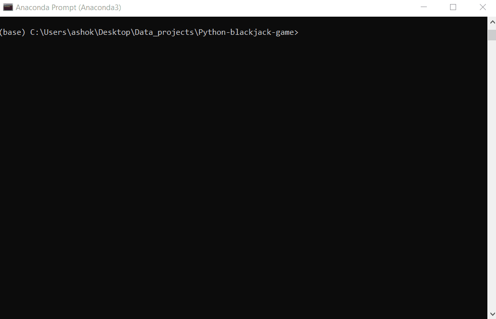

# Python-blackjack-game

Code from a tutorial on Python object oriented programming. Uses classes for Deck, Cards, Hand, and Game to build the game structure.

Relatively basic example and lots of room for added functionality (the website also has an alternate tutorial that creates a GUI in addition), but overall this was very useful for me to work with object-oriented programming and classes/methods.

Source: https://dev.to/nexttech/build-a-blackjack-command-line-game-3o4b